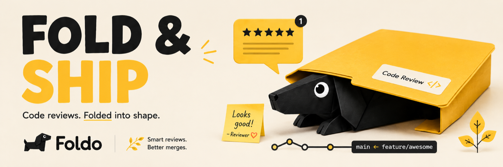

<p align="center">
  
</p>

<h1 align="center">Foldo</h1>

<p align="center">
  <strong>A Figma-style multiplayer review canvas for AI-generated code.</strong><br/>
  Comment, compare, and ship the changes Claude Code (and other agents) just wrote — without leaving the canvas.
</p>

<p align="center">
  <a href="#"></a>
  <a href="#"></a>
  <a href="#"></a>
  <a href="#"></a>
  <a href="#"></a>
  <br/>
  <a href="#"></a>
  <a href="#"></a>
  <a href="#"></a>
  <a href="#"></a>
  <a href="#"></a>
</p>

<p align="center">
  <a href="#-quick-start">Quick start</a>
  · <a href="#-the-demo-path">Demo</a>
  · <a href="#-architecture">Architecture</a>
  · <a href="docs/ARCHITECTURE.md">Deep wiki</a>
  · <a href="#-roadmap">Roadmap</a>
</p>

---

## 🪡 Why Foldo

The bottleneck in software development has shifted. With Claude Code and similar agents, **writing variants is cheap and fast** — but **reviewing them**, comparing them, commenting on them, deciding which to ship, and getting changes made is still stuck in text-first tools designed for an era when humans wrote every line.

Today, AI codegen output leaks out of the developer's terminal into Slack, Loom, screenshots dropped into Notion, and Figma comments about implementations the designer can't actually run. **Foldo closes that loop.**

It is the missing review surface for a world where most code is written by agents and the human's job is to direct, compare, and approve.

The name comes from **fold** — the point where two things meet (branches folding together at merge), the act of revealing hidden state (a foldout), and a familiar software metaphor (code folding). The product folds parallel AI-generated work back into a single spatial surface where humans can see it all at once.

### Foldo is for

- **Developers running Claude Code** (or any AI coding agent) who currently triage variants in their terminal — opening preview URLs one by one, switching branches, losing context.
- **Everyone who reviews what agents built but doesn't run code locally**: PMs, designers, founders reviewing contractor work, engineers reviewing teammates' AI-assisted branches. Today these people are locked out of the review loop.

Foldo turns the linear shuffle into a **spatial canvas with live, interactive frames** — so any reviewer can pin a comment, request a change in natural language, and watch the agent ship a new commit.

And every reviewer on the canvas is still a *proxy* for the real user — so Foldo now also gathers evidence from **real users**, not just internal eyes. With **User Tests**, real people record screen+voice sessions against your build and the results land as frames you can comment on: the **build → real users → evidence → fix** loop, closed without leaving the canvas.

---

## ✨ Features

- 🎬 **User Tests** — publish a short `foldo.dev/t/:token` link, real users record screen+voice sessions completing your tasks, and the results — recording, per-task outcomes, questionnaire answers, transcript, AI synthesis — stream back onto the board as frames. Three auto-detected delivery modes (`iframe`, `handoff`, `dom_snapshot`) cover everything from an embedded app to a localhost-only build.
- 🎙️ **Evidence, not proxies** — each session lands as a scrubbable `test_session` frame clustered under a `test_summary` with per-task completion stats; Claude synthesizes a summary + extracted issues, and every issue carries a **"Make this an edit"** button straight into the dispatch pipeline.
- 🖼️ **Live app frames** — every frame is an iframe of the actual running app at a specific commit, navigated to a specific reproducible state (modal open, form half-filled, recipe-replayed).
- 📄 **Markdown frames** — PRDs, ADRs, READMEs render side-by-side with the code that implements them.
- 💬 **Pinned comments** with replies, resolve, and **"Make this an edit"** → turn any thread into a structured Claude Code prompt.
- ⚡ **Streaming edit dispatches** — your comment flows back to local Claude Code via an MCP server; new frames appear on the canvas with connector lines to their parent as the agent works.
- 👥 **Multiplayer**: live cursors, presence avatars, selection ghosts, follow-me viewports — Figma-grade real-time over plain WebSockets.
- 🔗 **Deep-linkable URLs** — every board, frame, and comment is shareable. Paste in Slack → open at the exact state.
- 📸 **Chrome extension** — capture *any* deployed URL (Vercel preview, staging, localhost) into a Foldo frame without running the MCP.
- 🎛️ **GitHub-aware** — webhook receiver auto-creates frames for every push; agent-authored branches carry a bot badge.

---

## 🚀 Quick start

```bash
git clone https://github.com/lukataylo/foldo.git
cd foldo
npm install
npm run dev
```

This boots three services concurrently:

| Service | URL | Description |
| --- | --- | --- |
| Web canvas | http://localhost:5173 | The Foldo canvas you actually use |
| Cloud server | http://localhost:4000 | REST + WebSocket + SQLite |
| Sample app | http://localhost:5174 | The "user's running app" rendered inside frames |

Open the canvas at **http://localhost:5173** and you'll land on `board-acme-landing` — a seeded board with three branches (one baseline, two AI-generated) and four pre-pinned comments.

To plug in the in-directory MCP server (so dispatches go through real tool execution rather than the in-process simulator):

```bash
npm run dev:mcp
```

To build the Chrome extension for unpacked install:

```bash
npm run build:extension
# then chrome://extensions → Developer mode → Load unpacked → apps/extension/dist
```

---

## 🎬 The demo path

The headline 30-second tour that proves the value:

1. **Open** http://localhost:5173 — the canvas loads with three rows (`main`, `feat/cta-revamp`, `feat/pro-tier-highlight`).
2. **Scroll** down to the `feat/cta-revamp` row and **click the orange pin** on the CTA button — Anna left a comment: *"Button still doesn't name the trial duration — spec says it has to."*
3. **Click "Make this an edit"** — the right-side edit panel opens with a structured prompt pre-filled (branch, commit, file, line, element, the recipe to reach this state, current source, and Anna's text as intent).
4. **Click "Send to Claude Code"** — a streaming run log shows `sending → running → done` as the agent replays the recipe, applies the edit, and pushes a new commit.
5. **A new frame** appears to the right with a curved connector line back to the parent. The CTA now reads **"Start your 14-day free trial"** and a no-credit-card line sits beneath it.
6. **Open a second browser** and pick a different demo user (top-right user switcher → "Mateo Rivas"). The two windows now see each other's cursors and selections live.

[More demo paths — Pro tier flow, Capture from URL, follow-me — in **[docs/DEMO.md](docs/DEMO.md)**].

---

## 🏗️ Architecture

Foldo is a TypeScript monorepo with **five workspaces and a shared protocol package**:

```
+----------------------+                  +----------------------+
|   Browser canvas     |  REST + WS       |    Cloud server      |
|   apps/web :5173     | <--------------> |   apps/server :4000  |
+----------+-----------+                  +----------+-----------+
           |                                          |
           | iframe                                   | WS /ws/mcp
           v                                          v
+----------+-----------+                  +----------+-----------+
|     Sample app       |                  |   In-dir MCP server  |
| apps/sample-app:5174 |                  |     apps/mcp         |
+----------------------+                  +----------+-----------+
                                                     ^ stdio
                                                     |
                                            +--------+---------+
                                            |   Claude Code    |
                                            +------------------+

                       Chrome extension (apps/extension)
                                |
                                v POST /api/captures
```

| Workspace | Tech | Role |
| --- | --- | --- |
| `apps/web` | Vite · React 18 · Tailwind | The user-facing canvas. Multiplayer cursors, presence, URL routing, comment threads, dispatch panel, live iframes. |
| `apps/server` | Fastify · `@fastify/websocket` · better-sqlite3 | REST + two WS endpoints (`/ws` for browsers, `/ws/mcp` for agents). Brokers dispatches; simulates in-process when no MCP is attached. |
| `apps/sample-app` | Vite · React 18 | Standalone pricing app rendered inside every app frame's iframe. Three variants. `postMessage` protocol for element selection + recipe replay. |
| `apps/mcp` | `@modelcontextprotocol/sdk` · `ws` | Local Node process exposing `foldo_freeze_current_state`, `foldo_replay_recipe`, `foldo_apply_edit_prompt`, `foldo_list_branches` to Claude Code over stdio, bridging to cloud over `/ws/mcp`. |
| `apps/extension` | Vite · `@crxjs/vite-plugin` · Manifest V3 | Chrome extension for capturing any deployed URL into a Foldo frame. Service worker, content scripts, popup. |
| `packages/protocol` | TypeScript types only | Single source of truth: domain model, WS message protocol, REST schemas, MCP tool schemas. Imported by every workspace. |

The **shared protocol** is what keeps the five components honest: every wire message and every REST shape is declared once in `packages/protocol/src/` and imported by everyone.

For a deeper dive: **[docs/ARCHITECTURE.md](docs/ARCHITECTURE.md)**.

---

## 🛰️ Multiplayer

Live multiplayer is built on a single WebSocket per browser tab:

- **Cursors** — throttled to ~33 Hz per sender, smoothly interpolated on receivers, counter-scaled to stay constant size at any zoom level.
- **Presence avatars** — top bar shows everyone currently on the board. Hover to follow, click to lock follow-me.
- **Selection ghosts** — when another user selects an element, you see a dashed outline in their color with a name tag.
- **Follow-me viewports** — viewport updates broadcast over WS so a presenter can drag everyone along.
- **Comments + replies** sync live across browsers; resolve toggles propagate instantly.

The cloud's WS hub is an in-memory pub/sub abstracted to be Redis-swappable for multi-instance scale.

---

## 🤖 Edit dispatches (Claude Code → Foldo)

When a reviewer hits **Send to Claude Code**, the cloud creates a `Dispatch` record and:

- If a local **MCP server** is connected for that board → routes the dispatch over `/ws/mcp`. The MCP runs the heuristic-driven edit (in prototype) or shells out to the real `claude` CLI (in production), replays the recipe to verify state, commits, pushes, and reports a new frame.
- If no MCP is online → simulates the same lifecycle in-process so the demo works solo.

Either way, the browser sees the same `dispatch.status` stream and the same `frame.added` event with a connector line drawn back to the parent.

Hook your own MCP server in by adding to your Claude Code `settings.json`:

```json
{
  "mcpServers": {
    "foldo": {
      "command": "node",
      "args": ["/absolute/path/to/foldo/apps/mcp/bin/foldo-mcp.mjs"]
    }
  }
}
```

Details: **[docs/MCP.md](docs/MCP.md)**.

---

## 🧪 Try it without setup

You don't need the MCP or the Chrome extension to evaluate Foldo:

1. `npm install && npm run dev`
2. Open http://localhost:5173 in two browser windows
3. Pick different demo users via the user switcher (top-right)
4. Drop comment pins, send dispatches, watch the canvas converge in real time

If the server isn't running, the canvas falls back to a fully-functional **offline demo** using local mock data.

---

## 🗺️ Workspaces

```
foldo/
├── apps/
│   ├── web/          # The canvas (Vite, React, Tailwind)
│   ├── server/       # Fastify + better-sqlite3 + WS
│   ├── sample-app/   # The user's "running app" — iframed
│   ├── mcp/          # @modelcontextprotocol/sdk in-dir agent
│   └── extension/    # Chrome MV3 capture-from-URL extension
├── packages/
│   └── protocol/     # Shared types: domain, WS, REST, MCP
├── docs/             # Deep wiki
└── scripts/          # WS multiplayer + dispatch smoke tests
```

---

## 📚 Deep wiki

| Doc | What it covers |
| --- | --- |
| **[ARCHITECTURE.md](docs/ARCHITECTURE.md)** | Component boundaries, data flow, ports, scaling notes |
| **[PROTOCOL.md](docs/PROTOCOL.md)** | REST endpoints, WS messages, MCP tool schemas, postMessage bridge |
| **[MCP.md](docs/MCP.md)** | Running the MCP server, wiring it to Claude Code, env vars, tool semantics |
| **[EXTENSION.md](docs/EXTENSION.md)** | Building, loading, and configuring the Chrome extension |
| **[DEMO.md](docs/DEMO.md)** | Full walkthroughs of every demo path with screenshots |
| **[DEPLOYMENT.md](docs/DEPLOYMENT.md)** | Putting Foldo on a real server: Postgres, Redis, GitHub App, auth |

---

## 🛠️ Tech stack

- **Language**: TypeScript 5.6 (strict)
- **Frontend**: React 18, Vite 5, Tailwind CSS 3
- **Backend**: Node 20, Fastify 5, `@fastify/websocket`, better-sqlite3, `nanoid`
- **Realtime**: plain `ws` over a single WebSocket per board; throttled cursor broadcasts; debounced viewport updates; ping/pong heartbeat with reconnect-backoff
- **Agent integration**: `@modelcontextprotocol/sdk` for Claude Code interop, `simple-git` for repo ops
- **Browser extension**: `@crxjs/vite-plugin` for Manifest V3
- **No state library** (a 200-line Map-based store + `useSyncExternalStore`)
- **No router library** (the History API + a tiny `parseRoute`/`buildPath` pair)

---

## 🧭 Roadmap

- [x] **User Tests (Phases 1–4)** — *shipped 2026-05-14.* Unmoderated UX testing folded into the canvas: public `foldo.dev/t/:token` links, three delivery modes, screen+voice recording, results-as-frames, pluggable transcription + Claude synthesis, S3/R2 storage, range playback, rate-limited public endpoints. Design doc: [docs/UX_TESTS.md](docs/UX_TESTS.md)
- [ ] **Real transcription provider** — swap the honest stub for a real speech-to-text provider behind the existing env-var hook
- [ ] **Production object-storage wiring** — promote the S3/R2 recording path from config-ready to deployed (buckets, lifecycle rules, signed URLs)
- [ ] **Real Claude Code dispatch** — shell out to the `claude` CLI from `apps/mcp/src/runner/editSim.ts` instead of inferring overrides
- [ ] **Headless Playwright frame capture** — real screenshots + DOM at a commit via `apps/mcp/src/runner/playwright.ts`
- [ ] **Postgres + Redis** for multi-instance — `apps/server/src/db.ts` (Postgres) + `apps/server/src/ws/hub.ts` (Redis pub/sub)
- [ ] **GitHub App** — production webhook with signature verification, OAuth login
- [ ] **Frame dragging** — the API exists (`POST /api/frames/:id/move`); UI affordance pending
- [ ] **Comment edit-in-place** & **delete** — REST endpoints exist; CommentPopover affordance pending
- [ ] **Real recipe verification** — Playwright replay to confirm an edit landed at the correct state before reporting `done`
- [ ] **Bigger boards** — virtualize the frame list; lazy-mount iframes are in; viewport culling pending

---

## 🤝 Contributing

Issues and PRs welcome. Each workspace owns its `dev`, `build`, and `typecheck` scripts; `npm run typecheck` at the root runs the whole suite. Smoke tests in `scripts/` exercise the multiplayer round-trip and the dispatch lifecycle.

---

## 📜 License

[MIT](LICENSE) — see the LICENSE file.

---

## 🔎 Keywords

`ai code review` · `claude code` · `multiplayer canvas` · `figma for code` · `agent code review` · `mcp server` · `model context protocol` · `pr review tool` · `pull request review` · `visual git diff` · `branch comparison` · `llm code review` · `developer collaboration` · `code review platform` · `live preview review` · `chrome extension capture` · `figma-style review` · `real-time review` · `pair programming with ai` · `unmoderated ux testing` · `user testing` · `usability testing` · `session recording` · `screen recording` · `user research`

---

<p align="center">
  <sub>Built as a demo of what review tools look like when most code is written by agents.<br/>
  Branding inspired by the dachshund — small, focused, low to the ground.</sub>
</p>
